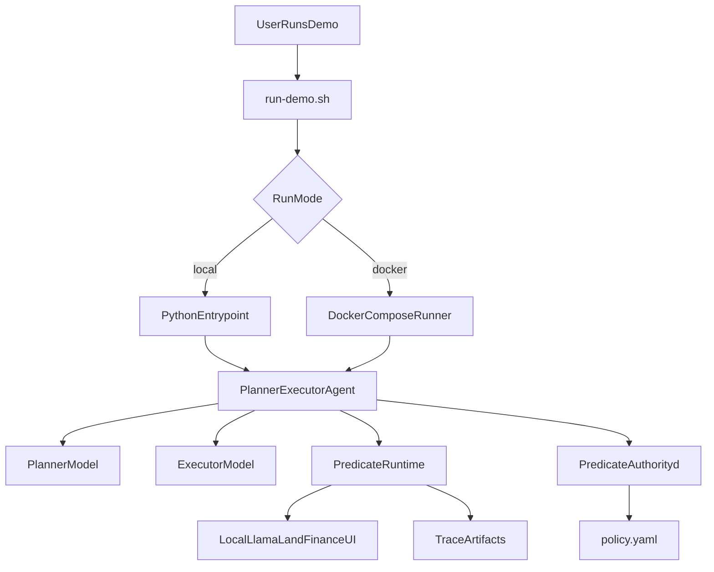
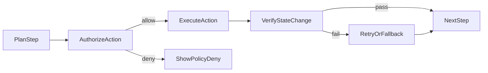

# Account Payable Demo Design

## Overview

This demo showcases a finance workflow where an agent system performs invoice exception triage across a realistic browser UI, with:

- pre-execution authorization through `predicate-authorityd`
- deterministic post-execution verification through `predicate-runtime`
- cloud or local small-model inference through the Python SDK provider layer

The most important user-facing moment is:

`the agent clicked the button, but the state never changed`

This demo is designed to prove that Predicate Systems catches that failure reliably.

## Demo Story

The 5-minute story should be:

1. open invoice, compare fields, add note
2. attempt `Mark Reconciled`
3. UI does not change
4. verification fails
5. attempt risky action like `Release Payment`
6. sidecar denies it
7. fall back to `Route To Review`
8. verification confirms the corrected action

## Architecture

## Finance UI Target

The recommended browser target is:

- local source: `sentience-sdk-playground/local-llama-land`
- deployed surface: `https://www.localllamaland.com`

Recommended route namespace:

- `app/demo/finance/page.tsx`
- `app/demo/finance/queue/page.tsx`
- `app/demo/finance/invoices/[id]/page.tsx`
- `app/demo/finance/vendor/[id]/page.tsx`
- `app/demo/finance/review/page.tsx`

## Control Loop

## Setup Matrix

| Mode | Sidecar | LLM | Best for | Recommendation |
|------|---------|-----|----------|----------------|
| Local shell + cloud | host binary | hosted API | development and debugging | supported |
| Local shell + local | host binary | host Ollama | local-first development | supported |
| Docker + cloud | host binary or future container sidecar | hosted API | easiest first-run | recommended default |
| Docker + local | host binary or future container sidecar | host Ollama | privacy demo with easy setup | strongly recommended |

## Deployment Recommendation

### Recommended default

Use:

- `./run-demo.sh --docker --llm cloud`

or:

- `./run-demo.sh --docker --llm local`

with Ollama running on the host machine.

### Why host Ollama

For this demo, host-machine Ollama is simpler than containerizing local model runtimes because it avoids:

- MLX and Apple Silicon container friction
- model cache and volume complexity
- GPU runtime mismatch

## Local Mode Sidecar Strategy

In local mode, the launcher should:

1. detect OS and architecture
2. resolve the sidecar release artifact from GitHub
3. download it into `.bin/`
4. run it against `policy.yaml`
5. fall back to a manual install message if auto-download fails

This adds some complexity, but it is acceptable as a convenience feature as long as:

- the sidecar version is pinned
- the failure mode is explicit
- the manual fallback is documented

## Initial Repo Requirements

The repo should contain:

- `.gitignore`
- `.env.example`
- `README.md`
- `DESIGN.md`
- `policy.yaml`
- `run-demo.sh`
- `main.py`
- `docker-compose.yml`

## V1 Scope

The scaffold should support:

- explicit local vs docker modes
- explicit cloud vs local model modes
- pre-created policy file
- a lightweight Python entrypoint
- a clean place to wire the real finance workflow next

It does not need to include the full workflow implementation yet.
